# Programación y Plataformas Web

## Práctica 1: Instalación, Configuración Inicial y Primer Endpoint

**Estudiante:** Sebastian Zurita  
**Carrera:** Ingeniería en Ciencias de la Computación  
**Institución:** Universidad Politécnica Salesiana  

---

## 1. Introducción al Framework
Spring Boot es un framework moderno diseñado bajo la filosofía *opinionated*, lo que significa que proporciona configuraciones por defecto para simplificar el inicio de proyectos Java orientados a la web. Su principal ventaja es la inclusión de servidores HTTP embebidos, permitiendo que las aplicaciones se ejecuten de forma autónoma (stand-alone) sin necesidad de despliegues externos complejos.

---

## 10. Resultados y Evidencias

### 1. Captura de verificación de Java
Verificación de la instalación del entorno de ejecución Java en su versión estable 17 (Eclipse Temurin LTS), asegurando la compatibilidad con el ecosistema del proyecto.


### 2. Captura del servidor Spring Boot ejecutándose
Inicialización de la aplicación utilizando el wrapper de Gradle. Se evidencia el banner oficial de Spring Boot y el levantamiento automático del servidor Tomcat embebido en el puerto por defecto.


### 3. Captura del endpoint /api/status funcionando
Prueba de conectividad y respuesta HTTP desde el cliente (navegador web) hacia el endpoint configurado, retornando la estructura de datos correspondiente en formato JSON.

URL de acceso: http://localhost:8080/api/status


### 4. Captura del comando de verificación en terminal
Listado del directorio de controladores para comprobar la correcta ubicación y existencia del archivo fuente que maneja la lógica de las peticiones HTTP.


## Práctica 3: API Rest

**Estudiante:** Sebastian Zurita  
**Carrera:** Ingeniería en Ciencias de la Computación  
**Institución:** Universidad Politécnica Salesiana  

## Evidencias 18/06

### 1.- Localhost del nuevo recurso Students:


### 2.- Students/count:


## Práctica 5: Persistencia real con PostgreSQL, Entidades JPA y Repositorios

**Estudiante:** Sebastian Zurita  
**Carrera:** Ingeniería en Ciencias de la Computación  
**Institución:** Universidad Politécnica Salesiana  

---

## 1. Introducción

En esta práctica se reemplazó el almacenamiento en memoria (ArrayList) por una base de datos real usando PostgreSQL, Spring Data JPA e Hibernate. Se implementó el módulo `products` con entidades JPA, repositorios y mappers siguiendo la misma arquitectura del módulo `users`.

---

## 10. Resultados y Evidencias

### 1. Aplicación Docker Desktop
Software de Docker funcionando con el contenedor `postgres-dev` activo.


### 2. Verificación en PostgreSQL — usuarios
Verificación de la tabla `users` creada automáticamente por Hibernate al iniciar la aplicación.


### 3. Creación de clases en `products`

Se implementó la misma arquitectura del módulo `users`:
- `ProductEntity` — extiende `BaseEntity`, representa la tabla `products`
- `ProductRepository` — extiende `JpaRepository`
- `ProductMapper` — convierte entre DTOs, modelos y entidades
- `ProductServiceImpl` — usa el repositorio, sin lista en memoria
- `ProductsController` — delega al servicio

### Evidencias

#### 3.1 Inserción de 5 productos desde Bruno
Se insertaron 5 registros de productos a través de Bruno usando el método POST.


#### 3.2 Visualización de productos — GET /api/products
Listado completo de los 5 productos retornados por la API REST.


#### 3.3 Visualización de producto específico — GET /api/products/3
Consulta de un producto por id retornado por la API REST.


#### 3.4 Verificación en PostgreSQL — productos
Consulta `SELECT * FROM products` mostrando los 5 registros almacenados en la base de datos.


---
### 4. Explicar el flujo:

**Desde API REST hacia PostgreSQL:**

El cliente envía una petición HTTP con un JSON, el ProductsController recibe un objeto de transferencia de datos (CreateProductDto). Este DTO es enviado al ProductServiceImpl, el cual utiliza el componente ProductMapper para transformar los datos de entrada al ProductModel y posteriormente a ProductEntity. El servicio llama al método `.save()` de ProductRepository, lo que provoca que Hibernate convierta la entidad en una sentencia SQL INSERT que se ejecuta en el contenedor de PostgreSQL. Durante este proceso, los interceptores de la clase abstracta BaseEntity (como `@PrePersist`) se encargan de establecer automáticamente los valores de auditoría, como la fecha de creación en createdAt y el estado lógico de eliminación.

**De PostgreSQL hacia la API REST:**

Una vez realizada la inserción, PostgreSQL genera el IDENTITY correspondiente. Hibernate toma este registro y lo convierte de vuelta en un objeto ProductEntity. El procesamiento regresa a la capa de servicio, donde el ProductMapper se encarga de transformar la entidad en un ProductResponseDto. Este DTO es el que finalmente devuelve el controlador al cliente en formato JSON, ocultando las propiedades internas de la base de datos y exponiendo únicamente la información necesaria.

## Práctica 6: Validación de DTOs y Control de Datos de Entrada

**Estudiante:** Sebastian Zurita  
**Carrera:** Ingeniería en Ciencias de la Computación  
**Institución:** Universidad Politécnica Salesiana  

---

## 1. Introducción

En esta práctica se implementó la validación de datos de entrada usando Jakarta Validation sobre el módulo `products`. Se agregaron anotaciones de validación a los DTOs, se activó `@Valid` en el controlador y se implementaron reglas de negocio en el servicio para proteger la integridad de los datos antes de que lleguen a PostgreSQL.


## 2. DTOs con validación

Se aplicaron las siguientes reglas mínimas:

| Campo   | Regla                                      |
|---------|--------------------------------------------|
| `name`  | obligatorio, mínimo 3, máximo 150 caracteres |
| `price` | obligatorio, mínimo 0                      |
| `stock` | obligatorio, mínimo 0                      |

- **`CreateProductDto`** y **`UpdateProductDto`**: todos los campos obligatorios (`@NotBlank`, `@NotNull`, `@Min`, `@Size`).
- **`PartialUpdateProductDto`**: sin `@NotBlank` ni `@NotNull` porque los campos son opcionales en un PATCH. Solo se validan formato y rango si el campo es enviado.

---

## 3. Validación en el controlador

Se agregó `@Valid` antes de `@RequestBody` en los endpoints `POST`, `PUT` y `PATCH`:

```java
@PostMapping
public ProductResponseDto create(@Valid @RequestBody CreateProductDto dto) {
    return service.create(dto);
}
```

---

## 4. Reglas de negocio en el servicio

Se implementaron tres reglas de negocio en `ProductServiceImpl`:

1. **`findAll` no devuelve productos eliminados** — se filtra con `.filter(p -> !p.isDeleted())`.
2. **No se puede actualizar un producto eliminado** — se verifica `isDeleted()` en `update` y `partialUpdate` antes de aplicar cambios.
3. **No se puede eliminar un producto ya eliminado** — se verifica `isDeleted()` en `delete` antes de hacer el soft delete.

## 5. Resultados y Evidencias

### 1. POST con datos inválidos — 400 Bad Request

Se envió un body con `name` vacío, `price` negativo y `stock` negativo. Spring Boot rechazó la petición con un **400 Bad Request** antes de llegar al servicio, detallando los 4 errores de validación encontrados.


### 2. PATCH con nombre muy corto — 400 Bad Request

Se intentó actualizar parcialmente un producto enviando un `name` de un solo carácter. La validación `@Size(min = 3)` rechazó la petición con **400 Bad Request**.


### 3. GET /api/products — productos eliminados no aparecen


### 4. PUT sobre producto eliminado — error de negocio

Se intentó actualizar un producto con `deleted = true`. El servicio lanzó una `IllegalStateException` con el mensaje *"No se puede actualizar un producto eliminado"*.


### 5. DELETE sobre producto ya eliminado — error de negocio

Se intentó eliminar un producto que ya tenía `deleted = true`. El servicio lanzó una `IllegalStateException` con el mensaje *"El producto ya fue eliminado"*.


## Práctica 7: Manejo Global de Errores y Excepciones

### Evidencias — Módulo Products

#### 1. Producto no encontrado (404 Not Found)

**Request:**
GET /api/products/999

**Response:**

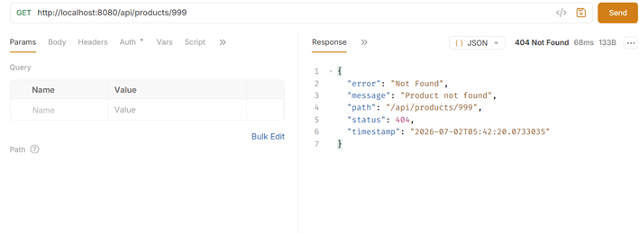

---

#### 2. Producto con nombre duplicado (409 Conflict)

**Request:**
POST /api/products
Content-Type: application/json
{
"name": "Mouse Logitech",
"description": "Otro mouse",
"price": 40.00,
"stock": 20
}

**Response:**

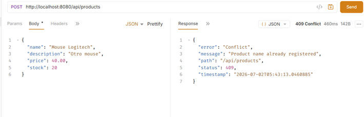

---

#### 3. Error de validación de datos (400 Bad Request)

**Request:**
POST /api/products
Content-Type: application/json
{
"name": "",
"description": "",
"price": -5,
"stock": -1
}

**Response:**

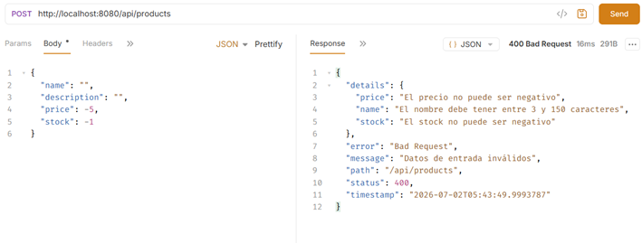

## Práctica 8: Relaciones ManyToOne, Foreign Keys y Consultas Relacionales

### Evidencias — Relaciones Products, Users y Categories

#### 1. Estructura de la tabla `products` en PostgreSQL

**Comando:**
\d products

**Resultado:**

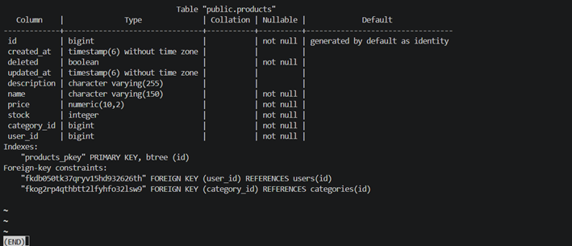

---

#### 2. Creación de producto con relaciones (owner y category anidados)

**Request:**
POST /api/products
Content-Type: application/json
{
"name": "Laptop Gaming",
"description": "Laptop para gaming de alto rendimiento",
"price": 1200.00,
"stock": 10,
"userId": 3,
"categoryId": 1
}

**Response:**

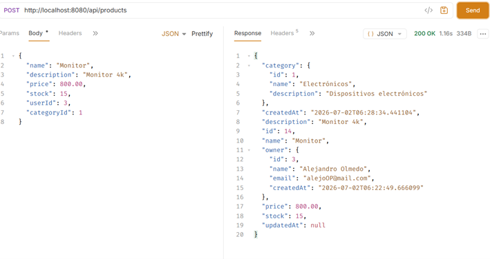

---

#### 3. Consulta de productos por categoría

**Request:**
GET /api/products/category/1

**Response:**

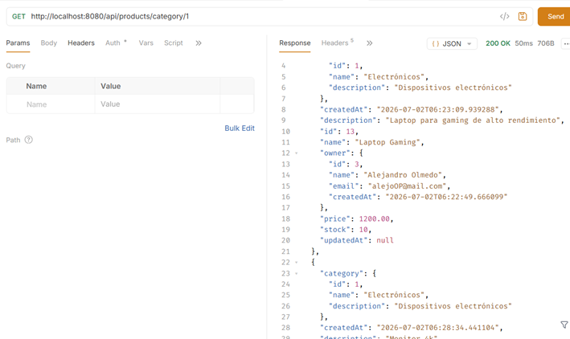

---


### Explicación — Relación ProductEntity con UserEntity y CategoryEntity

Para relacionar `ProductEntity` con `UserEntity` y `CategoryEntity` usé la anotación 
`@ManyToOne`, que indica que muchos productos pueden pertenecer a un mismo usuario o 
a una misma categoría.

En cada relación usé `@JoinColumn` para definir el nombre de la columna de clave 
foránea que se crea en la tabla `products`:

- `@JoinColumn(name = "user_id")` crea la columna `user_id`, que apunta a `users(id)`.
- `@JoinColumn(name = "category_id")` crea la columna `category_id`, que apunta a `categories(id)`.

Configuré ambas relaciones con `optional = false` porque un producto no puede existir 
sin un usuario ni sin una categoría. También usé `fetch = FetchType.LAZY` para que los 
datos del usuario y la categoría solo se carguen cuando realmente los necesito, y así 
evitar consultas innecesarias.

Antes de guardar un producto, en el servicio valido que el `userId` y el `categoryId` 
que me envían correspondan a un usuario y una categoría que existan y no estén 
eliminados lógicamente. Así evito guardar productos con relaciones que apunten a datos 
que ya no existen.
## Práctica 9 (Spring Boot): Request Parameters, Consultas Relacionadas y Filtrado con JPA

## 27. Resultados y evidencias

### 9.1 Producto creado con varias categorías

Se crea un producto asignándole múltiples categorías simultáneamente mediante el campo `categoryIds`.

**Request:**
```json
POST /products
{
  "name": "Laptop Gaming",
  "price": 1200.0,
  "stock": 5,
  "userId": 1,
  "categoryIds": [1, 2, 3]
}
```

**Evidencia:**

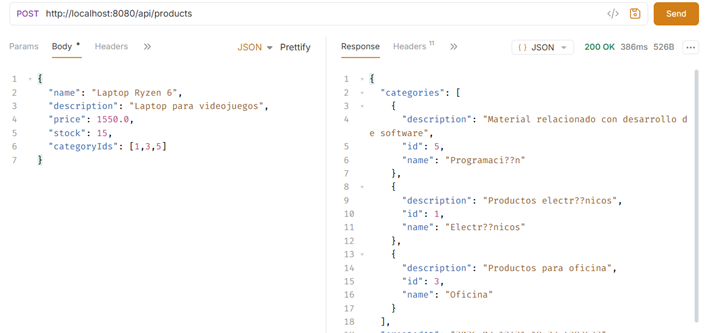

---

### 9.2 Consulta con filtros por usuario

Se consultan los productos de un usuario aplicando filtros de nombre y precio mínimo.

**Request:**
GET /api/users/1/products?name=laptop&minPrice=500

**Evidencia:**

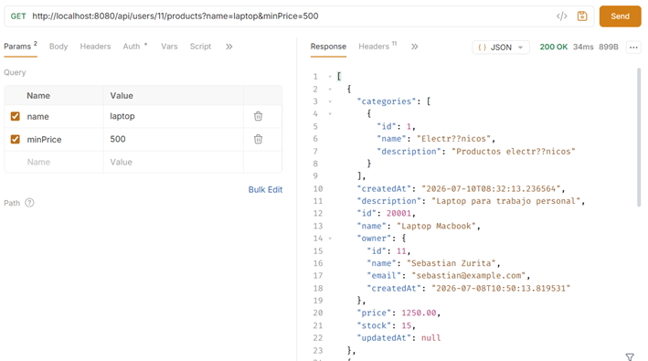

---

### 9.3 Consulta con filtros por categoría

Se consultan los productos de una categoría específica, filtrando además por el usuario propietario.

**Request:**
GET /api/categories/2/products?userId=1

**Evidencia:**

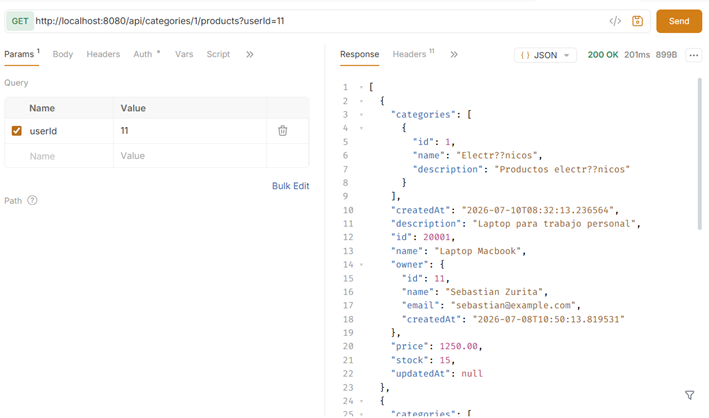

---

### 9.4 Explicación breve

**¿Por qué se usa `ProductService` y `ProductRepository` para consultar productos aunque el endpoint esté dentro del contexto `/users/{id}/products` o `/categories/{id}/products`?**

Aunque la ruta HTTP esté anidada bajo `/users` o `/categories`, el recurso que realmente se está consultando sigue siendo `Product`. Por eso la responsabilidad de construir y ejecutar la consulta le corresponde a `ProductService` y `ProductRepository`, y no a `UserService`/`CategoryService`. Esto respeta el principio de responsabilidad única: cada servicio y repositorio se encarga únicamente de la entidad que gestiona. `CategoriesController` y `UsersController` solo reciben la petición y delegan hacia `ProductService`, actuando como una fachada del contexto, pero la lógica de acceso a datos de productos permanece centralizada en un solo lugar, evitando duplicación de queries y facilitando el mantenimiento.

**¿Qué cambió al pasar de `Product N ──── 1 Category` a `Product N ──── N Category`?**

- En la relación `N──1`, cada producto tenía **una sola** categoría, mapeada con `@ManyToOne` y una columna de clave foránea (`category_id`) directamente en la tabla `products`.
- Al pasar a `N──N`, un producto puede pertenecer a **varias** categorías simultáneamente, y una categoría puede agrupar **varios** productos. Esto se implementó con `@ManyToMany` en `ProductEntity`, usando una tabla intermedia (`product_categories`) que almacena los pares `product_id` / `category_id`.
- Esto implicó cambios en:
  - El modelo de datos (nueva tabla intermedia en vez de columna FK).
  - Los DTOs, que pasaron de manejar un único `categoryId` a un conjunto `categoryIds` (`Set<Long>`).
  - Las consultas del repositorio, que ahora requieren `JOIN` con la colección `p.categories` y `DISTINCT` para evitar filas duplicadas cuando un producto coincide con varias categorías filtradas.
  - La lógica de creación/actualización, que ahora valida y asocia un conjunto de categorías en lugar de una sola.

## Práctica 10 (Spring Boot): Paginación de Productos con Page, Slice y Pageable

### Autor
- Sebastian Zurita

---

### 22. Resultados y evidencias

#### Captura de respuesta con Page

Ejemplo:

```
GET /api/products/page?page=0&size=5
```

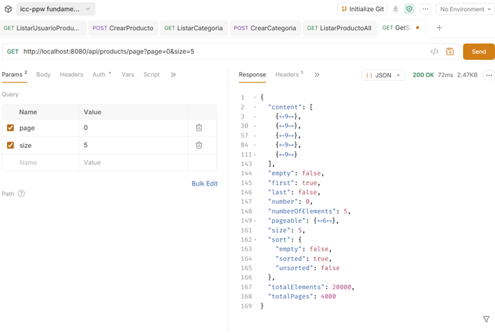

---

#### Captura de respuesta con Slice

Ejemplo:

```
GET /api/products/slice?page=0&size=5
```

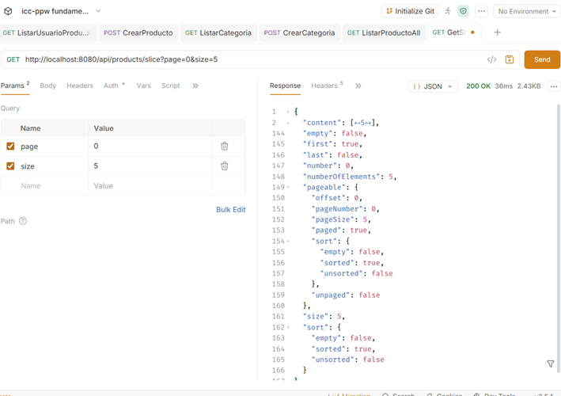

---

#### Captura de error por paginación inválida

Ejemplo:

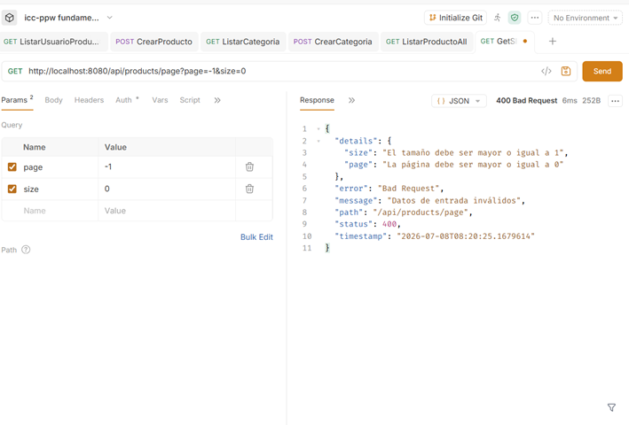


---

#### Captura de endpoint de categoría paginado (Page)

Ejemplo:

```
GET /api/categories/2/products/page?page=110&size=5
```

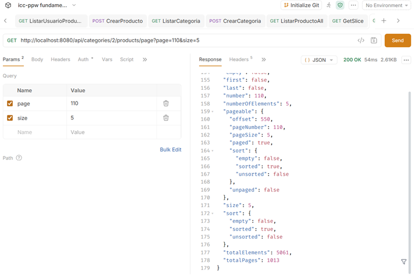

---

#### Captura de endpoint de categoría paginado (Slice)

Ejemplo:

```
GET /api/categories/2/products/slice?page=10&size=5
```

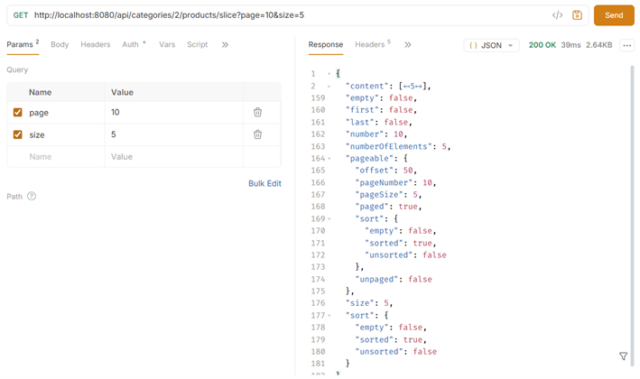

---

### Explicación breve

**¿Cuál es la diferencia entre Page y Slice?**

`Page` ejecuta dos consultas: una para traer los datos (`LIMIT`/`OFFSET`) y otra `COUNT` para saber el total de registros. Gracias a eso puede devolver `totalElements` y `totalPages`, lo que permite mostrar cosas como "página 3 de 20". `Slice`, en cambio, solo ejecuta la consulta de datos (pidiendo un registro extra internamente para saber si hay página siguiente), por lo que es más rápido y liviano, pero no sabe cuántos registros ni páginas hay en total — solo si existe página siguiente o anterior. `Page` conviene para tablas administrativas con navegación numerada; `Slice` conviene para scroll infinito o "cargar más".

**¿Por qué la paginación debe aplicarse en el repositorio y no después de traer todos los datos en memoria?**

Porque si se pagina en memoria, el backend igual tiene que traer todos los registros de la base de datos, cargarlos en memoria y recién ahí cortar el subconjunto — es decir, no se resuelve el problema original de rendimiento, memoria, red y tiempo de respuesta. Al paginar en el repositorio con `Pageable`, Spring Data JPA traduce la paginación directamente a `LIMIT` y `OFFSET` en SQL, de modo que es la propia base de datos la que filtra y devuelve solo los registros necesarios. Esto reduce el consumo de memoria del servidor, el tráfico de red y el tiempo de respuesta, especialmente cuando existen miles o millones de registros.

## Practica 11: Autenticación JWT, Autorización por Roles y Protección de Endpoints
## Entregables
### 11.1 Registro exitoso

Se registra un nuevo usuario, generando el token JWT y asignando automáticamente el rol `ROLE_USER`.

**Request:**
POST /api/auth/register

**Evidencia:**

- Código de respuesta: `201 Created`
- Token generado
- Rol asignado: `ROLE_USER`

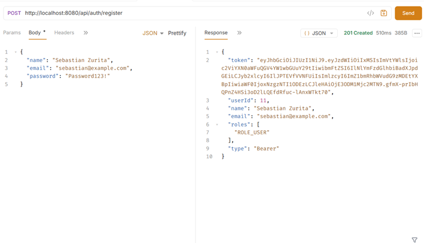

---

### 11.2 Login exitoso

Se autentica un usuario existente, devolviendo el token JWT junto con sus roles.

**Request:**
POST /api/auth/login

**Evidencia:**

- Código de respuesta: `200 OK`
- Token generado
- Roles devueltos

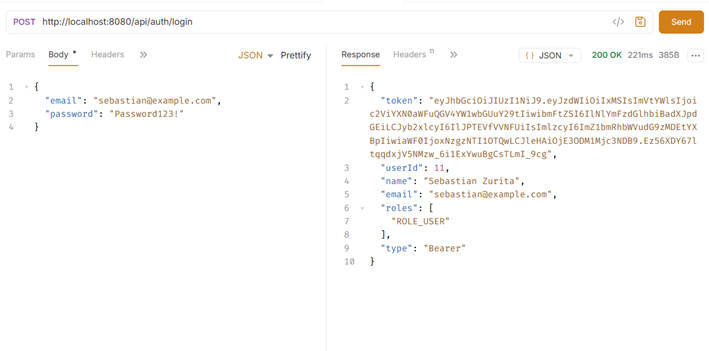

---

### 11.3 Endpoint protegido sin token

Se intenta acceder a un endpoint protegido sin enviar el header `Authorization`.

**Request:**
GET /api/products/page?page=0&size=5

**Evidencia:**

- Código de respuesta: `401 Unauthorized`

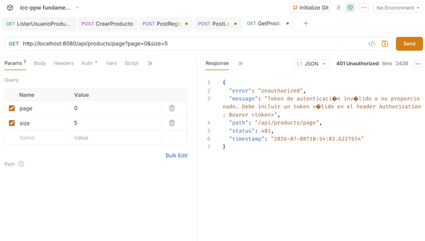

---

### 11.4 Endpoint protegido con token

Se accede al mismo endpoint enviando el token JWT válido en el header.

**Request:**
GET /api/products/page?page=0&size=5
Authorization: Bearer <token>

**Evidencia:**

- Código de respuesta: `200 OK`

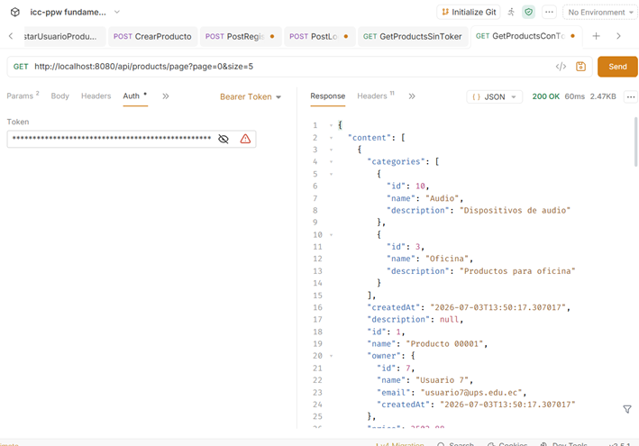

## Practica 12: Protección de Endpoints con Roles

## 12. Resultados y evidencias

### 12.1 Usuario autenticado

Se consulta la información del usuario actualmente autenticado a partir de su token JWT.

**Request:**
GET /api/users/me
Authorization: Bearer <token>

**Evidencia:**

- `id`
- `name`
- `email`
- `roles`

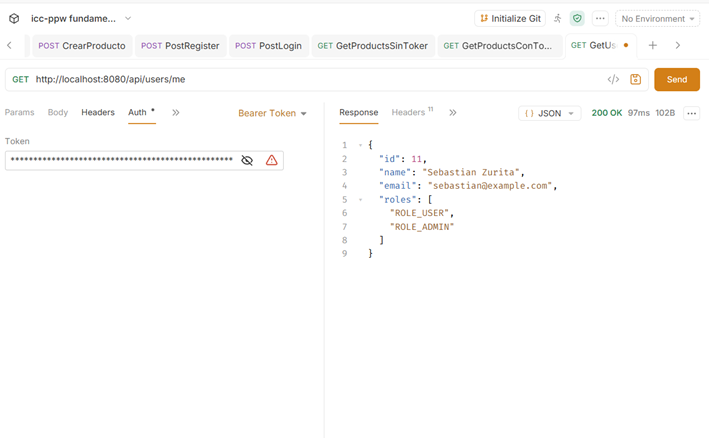

---

### 12.2 Acceso denegado por rol

Se intenta acceder a un endpoint restringido para administradores usando un token de un usuario con `ROLE_USER`.

**Request:**
GET /api/products
Authorization: Bearer <token con ROLE_USER>

**Evidencia:**

- Código de respuesta: `403 Forbidden`

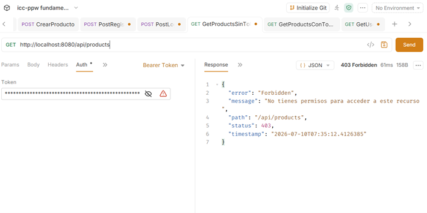

---

### 12.3 Acceso permitido por rol ADMIN

Se accede al mismo endpoint utilizando un token de un usuario con `ROLE_ADMIN`.

**Request:**
GET /api/products
Authorization: Bearer <token con ROLE_ADMIN>

**Evidencia:**

- Código de respuesta: `200 OK`

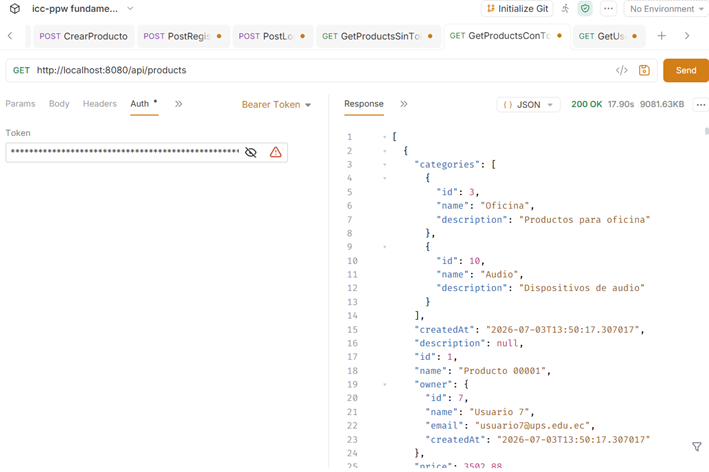

---

### 12.4 Explicación breve

**¿Cuál es la diferencia entre autenticación y autorización?**

La **autenticación** verifica *quién es* el usuario, es decir, valida su identidad (por ejemplo, comprobando usuario/contraseña en el login y generando un token JWT que lo representa). La **autorización**, en cambio, determina *qué puede hacer* ese usuario ya autenticado, es decir, si tiene permiso para acceder a un recurso o ejecutar una acción específica, en función de sus roles o privilegios. En Spring Security, la autenticación ocurre al validar el token JWT en cada petición (identificando al usuario), mientras que la autorización ocurre al evaluar anotaciones como `@PreAuthorize("hasRole('ADMIN')")`, que deciden si ese usuario autenticado tiene el rol necesario para continuar.

**¿Por qué `GET /api/products` debe ser solo para ADMIN, mientras `GET /api/products/page` puede ser consumido por cualquier usuario autenticado?**

`GET /api/products` devuelve **la lista completa** de productos sin paginación ni restricciones, lo cual expone todos los registros del sistema de una sola vez. Esto es información sensible desde el punto de vista de rendimiento y de administración, por lo que se reserva a usuarios con `ROLE_ADMIN`, quienes necesitan visibilidad total para tareas de gestión. En cambio, `GET /api/products/page` entrega los datos de forma **paginada y controlada**, pensado para el consumo habitual de cualquier usuario autenticado (por ejemplo, para navegar el catálogo), sin comprometer el rendimiento del servidor ni exponer de golpe toda la base de datos. La paginación actúa como un mecanismo natural de control de acceso a nivel de volumen de datos, permitiendo que el endpoint sea seguro para un público más amplio.

## Practica 13: Validación de Propiedad de Recursos

## 13. Resultados y evidencias

### 13.1 Creación de producto con usuario autenticado

Se crea un producto utilizando el token del usuario autenticado, quien queda automáticamente asignado como propietario (`owner`).

**Request:**
POST /api/products
Authorization: Bearer <token>

**Evidencia:**

- Código de respuesta: `201 Created`
- Producto creado
- `owner` corresponde al usuario autenticado

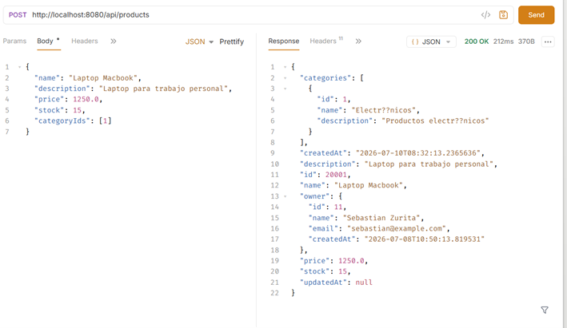

---

### 13.2 Bloqueo por producto ajeno

Se intenta modificar un producto que pertenece a otro usuario, utilizando un token distinto al del propietario.

**Request:**
PUT /api/products/{id}
Authorization: Bearer <token de otro usuario>

**Evidencia:**

- Código de respuesta: `403 Forbidden`
- Mensaje: "No puedes modificar productos ajenos"

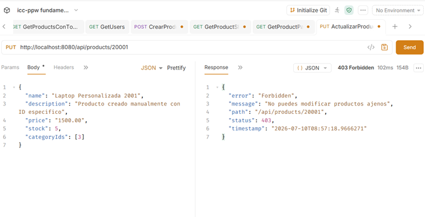

---

### 13.3 Eliminación de producto ajeno bloqueada

Se intenta eliminar un producto que pertenece a otro usuario, utilizando un token distinto al del propietario.

**Request:**
DELETE /api/products/{id}
Authorization: Bearer <token de otro usuario>

**Evidencia:**

- Código de respuesta: `403 Forbidden`

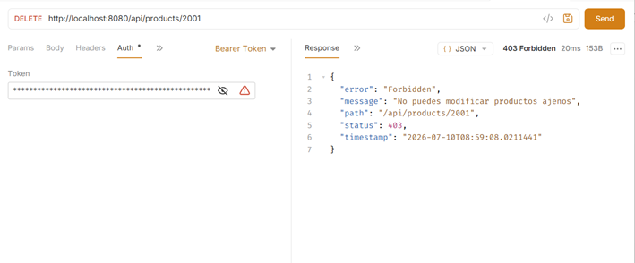

---

### 13.4 ADMIN modificando producto ajeno

Se modifica un producto que pertenece a otro usuario, utilizando un token con `ROLE_ADMIN`.

**Request:**
PUT /api/products/{id}
Authorization: Bearer <token con ROLE_ADMIN>

**Evidencia:**

- Código de respuesta: `200 OK`

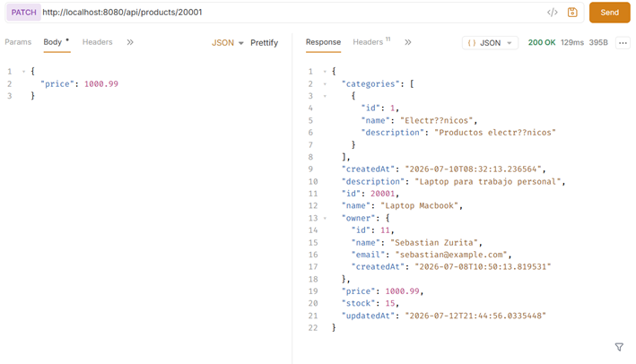

---

### 13.5 Explicación breve

**¿Qué es ownership?**

El *ownership* (propiedad) es el mecanismo de autorización que restringe las operaciones de modificación o eliminación de un recurso únicamente a quien lo creó (su propietario), independientemente de que esté autenticado y tenga permisos generales sobre ese tipo de recurso. En este proyecto, cada `Product` almacena una referencia a su `owner` (el usuario que lo creó), y antes de permitir un `UPDATE`, `PATCH` o `DELETE`, el servicio verifica que el `id` del usuario autenticado coincida con el `id` del `owner` del producto. Si no coincide, se lanza `AccessDeniedException` (403), salvo que el usuario tenga un rol superior como `ROLE_ADMIN`, que omite esta validación.

**¿Por qué no es seguro recibir `userId` en `CreateProductDto`?**

Si el cliente pudiera enviar el `userId` directamente en el body de la petición, cualquier usuario autenticado podría crear productos asignándolos a la cuenta de otra persona, simplemente cambiando ese valor en el JSON. Esto rompe la integridad del ownership, ya que el propietario del recurso dejaría de depender de quién realmente hizo la petición y pasaría a depender de un dato arbitrario controlado por el cliente. Por eso, el `owner` del producto debe obtenerse siempre del usuario autenticado (extraído del token JWT mediante `@AuthenticationPrincipal`), y nunca de un campo que el cliente pueda manipular libremente.

**¿Cuál es la diferencia entre autorización por rol y autorización por ownership?**

La **autorización por rol** decide el acceso en función de una categoría general asignada al usuario (por ejemplo, `ROLE_ADMIN` puede acceder a cualquier producto, sin importar quién lo creó). Es una regla estática que aplica igual para todos los usuarios que comparten ese rol. La **autorización por ownership**, en cambio, es una regla dinámica y específica del recurso: depende de la relación entre el usuario autenticado y el dato concreto que se está accediendo (si el `userId` del token coincide con el `owner.id` del producto). Un mismo usuario puede tener permiso sobre un producto (el suyo) y no tenerlo sobre otro (el de alguien más), aunque su rol sea el mismo en ambos casos. En la práctica, ambas se combinan: primero se verifica si el rol otorga acceso total (como `ADMIN`), y si no, se cae al chequeo de ownership como segunda barrera de seguridad.


## Práctica 14: Renovación de Access Token con Refresh Token

## Resultados y Evidencias

En esta sección se presentan las capturas que demuestran el funcionamiento correcto del flujo completo de autenticación, renovación y revocación de tokens.

---

### 28.1. Captura de Login con Refresh Token

* **Endpoint:** `POST /api/auth/login`
* **Descripción:** Inicio de sesión exitoso. Retorna los datos del usuario junto al `token` de acceso, el `refreshToken` y sus `roles`.


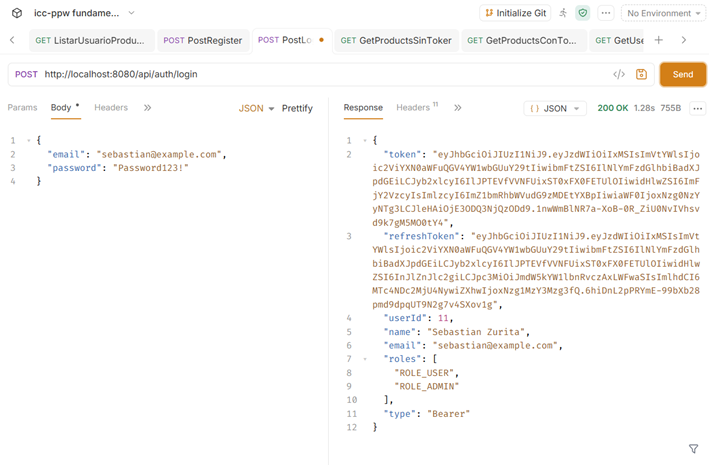

*Evidencia en la respuesta:*
- `token`
- `refreshToken`
- `roles`

---

### 28.2. Captura de Refresh Exitoso

* **Endpoint:** `POST /api/auth/refresh`
* **Descripción:** Renovación exitosa del token utilizando un `refreshToken` válido y no revocado.


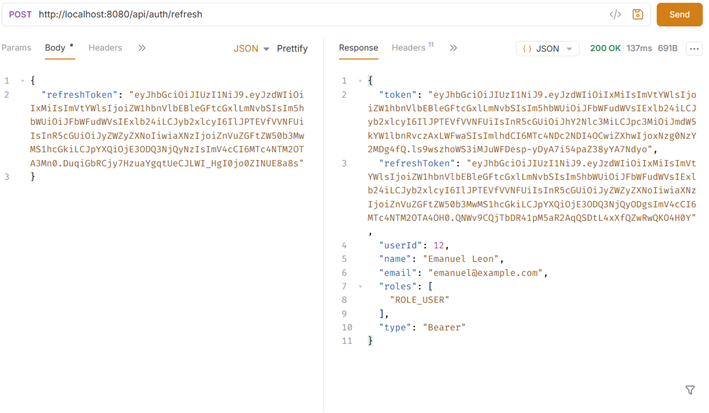

*Evidencia en la respuesta:*
- **Estado:** `200 OK`
- `token` (nuevo access token generado)
- `refreshToken` (nuevo refresh token generado por la rotación)

---


### 28.3. Captura de Logout

* **Endpoint:** `POST /api/auth/logout`
* **Descripción:** Cierre de sesión que revoca el `refreshToken` activo en la base de datos.


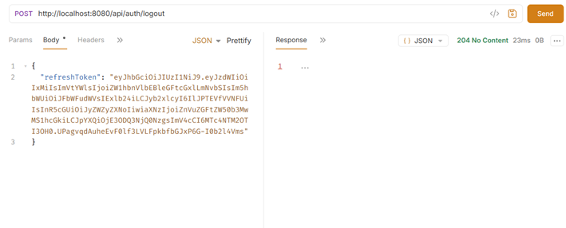

*Evidencia en la respuesta:*
- **Estado:** `204 No Content`

---

### 28.4. Captura de Refresh después de Logout

* **Endpoint:** `POST /api/auth/refresh`
* **Descripción:** Intento fallido de renovar tokens enviando un `refreshToken` que ya fue revocado previamente durante el logout.


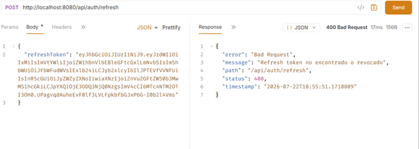

*Evidencia en la respuesta:*
- **Estado:** `400 Bad Request`
- Mensaje/Causa: *Refresh token revocado*

---

### 28.5. Explicación Teórica

#### ¿Cuál es la diferencia entre access token y refresh token?
* **Access Token:** Es un token de **corta duración** (minutos u horas) que se envía en cada petición para autorizar el acceso a recursos protegidos. No requiere consultar la base de datos en cada petición (es *stateless*).
* **Refresh Token:** Es un token de **larga duración** (días o semanas) cuyo único propósito es solicitar un nuevo *Access Token* cuando el actual expira. Se almacena y valida contra la base de datos para poder ser revocado si es necesario.

#### ¿Por qué el refresh token no debe usarse en Authorization: Bearer?
El encabezado `Authorization: Bearer` está reservado exclusivamente para autenticar y autorizar el acceso a los endpoints de la API. Si un *Refresh Token* pudiera usarse como *Bearer Token*, perdería su propósito de seguridad: un atacante que intercepte un *Refresh Token* podría consumir recursos del sistema durante días o semanas sin restricción, anulando el beneficio de tener un *Access Token* de vida corta.

#### ¿Qué significa rotar un refresh token?
Rotar un *Refresh Token* (*Refresh Token Rotation*) es un mecanismo de seguridad en el que, **cada vez que se utiliza un refresh token para obtener un nuevo access token, el refresh token usado queda inmediatamente invalidado/revocado y se entrega uno totalmente nuevo**. Esto previene ataques de reutilización y permite detectar si un token ha sido robado o interceptado.

## Práctica 15: Documentación de Endpoints con Swagger, OpenAPI y Seguridad JWT

## 23. Resultados y Evidencias 

### Evidencias Fotográficas

#### 1. Swagger UI cargado
Muestra la interfaz interactiva de Swagger UI cargada con los controladores y endpoints organizados por etiquetas.

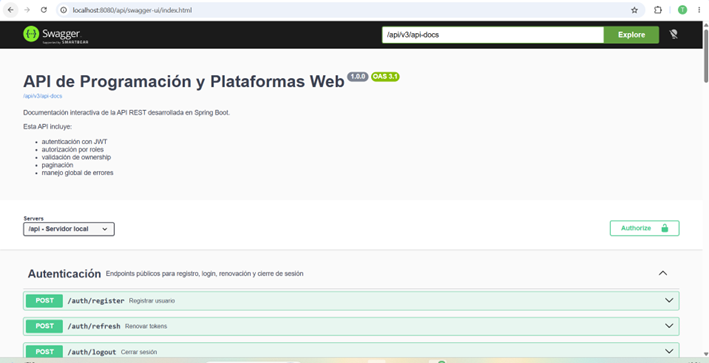

---

#### 2. JSON OpenAPI
Muestra la especificación OpenAPI generada en formato JSON con la estructura básica (`openapi`, `paths`, `components`).

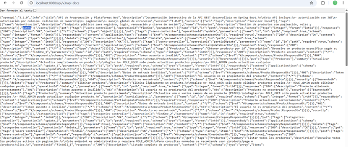

---

#### 3. AuthController Documentado
Muestra el grupo de controladores de autenticación con las descripciones de los endpoints de login, registro, refresh y logout.

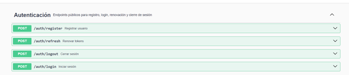

---

#### 4. Configuración del botón Authorize
Muestra la ventana modal del botón Authorize con el esquema de seguridad `bearerAuth` configurado para tokens JWT.

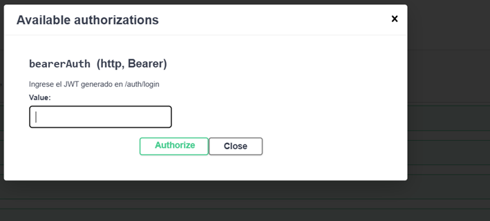

---

#### 5. Endpoint protegido sin token (401 Unauthorized)
Petición al endpoint `GET /api/products/page` realizada sin adjuntar un token en el encabezado `Authorization`.

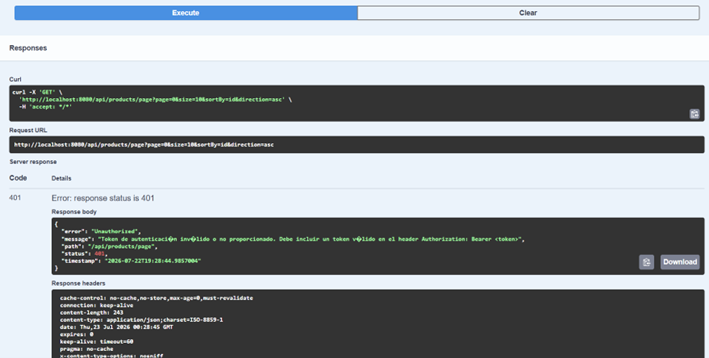

---

#### 6. Endpoint protegido con token desde Swagger (200 OK)
Petición al endpoint `GET /api/products/page` realizada exitosamente tras autenticarse con un token JWT válido desde el botón Authorize.

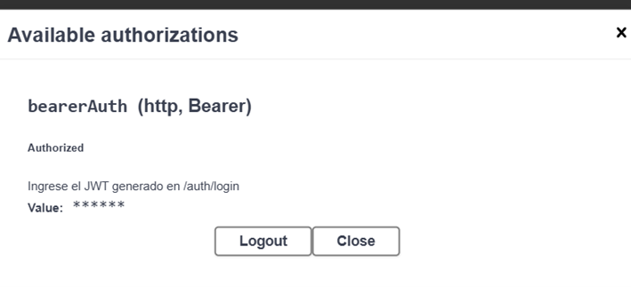


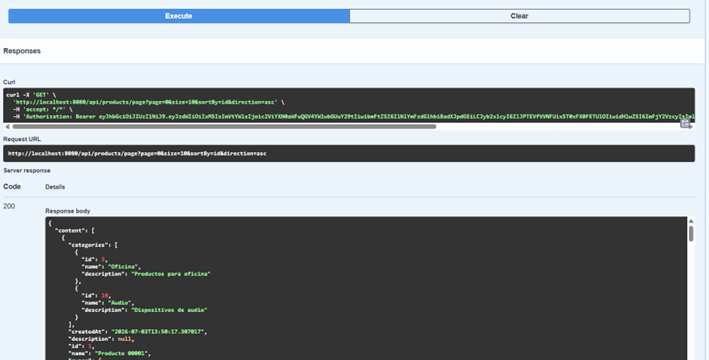

---

#### 7. Endpoint ADMIN consultado con usuario normal (403 Forbidden)
Intento de acceso a un recurso restringido para administradores utilizando un token que únicamente cuenta con el rol `ROLE_USER`.

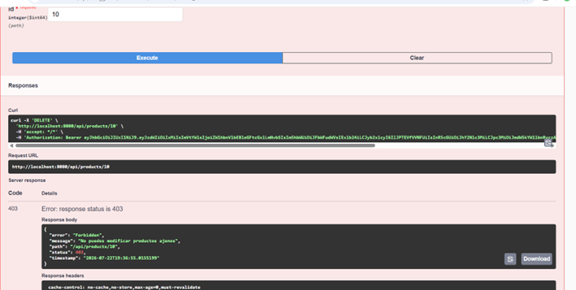

---

#### 8. Endpoint ADMIN consultado con usuario administrador (200 OK)
Acceso concedido al recurso restringido tras autenticarse con un token que contiene el rol `ROLE_ADMIN`.

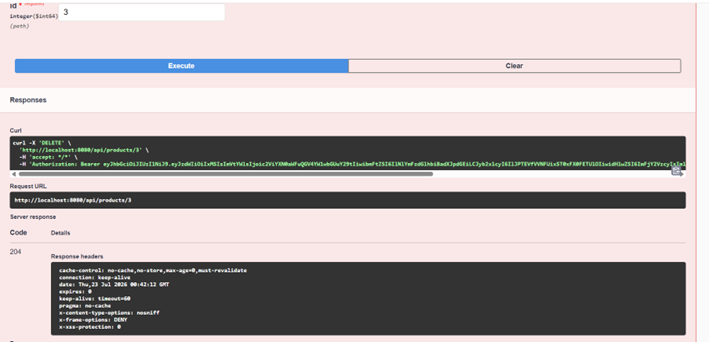

---

---

### Explicación Breve (Cuestionario Teórico)

#### ¿Cuál es la diferencia entre Swagger UI y OpenAPI?
* **OpenAPI:** Es una **especificación técnica estándar** y agnóstica (definida en formato JSON o YAML) que describe la estructura, contratos, rutas, parámetros, esquemas de datos y métodos de autenticación de una API RESTful.
* **Swagger UI:** Es una **herramienta visual/interactiva** (una interfaz de usuario web) que lee e interpreta el archivo o especificación OpenAPI para renderizar una página interactiva, permitiendo a los desarrolladores consultar la documentación y realizar pruebas sobre la API en tiempo real.

---

#### ¿Por qué Swagger puede ser público pero los endpoints seguir protegidos?
Porque Swagger UI actúa únicamente como una **capa visual de documentación y cliente HTTP**. La exposición pública de la interfaz de Swagger permite a los clientes consultar cómo deben estructurarse los datos y qué endpoints existen. Sin embargo, **Spring Security sigue evaluando de manera independiente cada solicitud HTTP recibida en los controladores**. Si una ruta está protegida por la configuración de seguridad, cualquier petición enviada desde la interfaz de Swagger que no adjunte un encabezado `Authorization: Bearer <token>` válido continuará siendo rechazada por el servidor con un código de estado `401 Unauthorized` o `403 Forbidden`.

---

#### ¿Cómo se configura Swagger para enviar un JWT en `Authorization: Bearer`?
Se configura mediante una clase anotada con `@Configuration` en Spring Boot, creando un Bean de tipo `OpenAPI`. En este Bean se declara un esquema de seguridad (`SecurityScheme`) con el tipo HTTP Bearer y el formato JWT, asignándole un nombre de referencia (por ejemplo, `bearerAuth`). Luego, este esquema se añade a los componentes globales y al `SecurityRequirement` de la API:

```java
@Configuration
public class OpenAPIConfig {

    @Bean
    public OpenAPI customOpenAPI() {
        return new OpenAPI()
            .addSecurityItem(new SecurityRequirement().addList("bearerAuth"))
            .components(new Components()
                .addSecuritySchemes("bearerAuth",
                    new SecurityScheme()
                        .name("bearerAuth")
                        .type(SecurityScheme.Type.HTTP)
                        .scheme("bearer")
                        .bearerFormat("JWT")
                        .description("Ingrese el JWT generado en /auth/login")));
    }
}

```

## Practica 16: Despliegue portable de Spring Boot con Docker y Nginx en Ubuntu Server

## 16. Entregables de la Práctica

### 1. Captura de `docker ps` de Ubuntu Server
Muestra ambos contenedores (`nginx` en puerto `80:80` y `fundamentos-api` expuesto de forma interna) en ejecución dentro de Ubuntu Server:

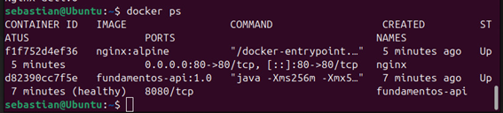

---

### 2. Captura de `curl` de `/api/actuator/health` desde Ubuntu Server
Verificación de la disponibilidad de la API ejecutado localmente desde la consola de Ubuntu Server a través de Nginx:

```bash
curl http://localhost/api/actuator/health
```
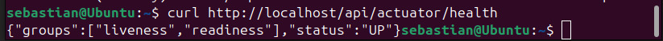


## 3. Captura de curl de /api/actuator/health desde la máquina anfitriona
Comprobación del flujo HTTP desde la máquina Windows accediendo a la IP de la máquina virtual Ubuntu (192.168.56.101) en el puerto 80 gestionado por Nginx:

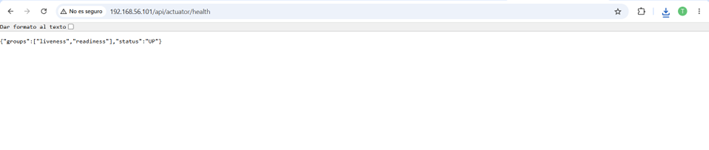


## 4. Explicación de la conexión a PostgreSQL externo
Para garantizar la portabilidad total de la imagen sin acoplar la base de datos dentro del contenedor:

Inyección de Variables de Entorno: Se suministró la variable DATABASE_URL=jdbc:postgresql://192.168.56.1:5432/devdb al contenedor mediante el archivo .env.ubuntu con el parámetro --env-file de Docker.

PostgreSQL en el Host: La base de datos se mantiene de forma independiente en la máquina anfitriona (Windows) escuchando en el puerto 5432.

Comunicación por Red Host-Only: La conexión entre la VM de Ubuntu y la máquina Windows se realiza a través del adaptador Host-Only de VirtualBox (subred 192.168.56.0/24), aceptando tráfico entrante en el puerto 5432.

## 5. Captura consumo de login desde la máquina anfitriona con Bruno
Demostración del consumo del endpoint de autenticación mediante el cliente Bruno desde Windows. La petición pasa por Nginx (http://192.168.56.101/api/auth/login), se procesa en Spring Boot y retorna el token JWT (200 OK):

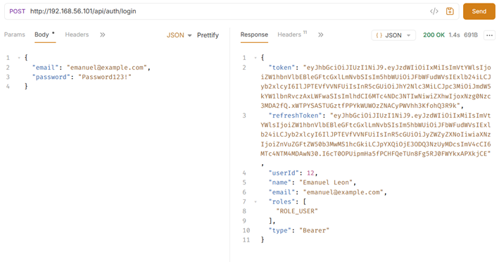