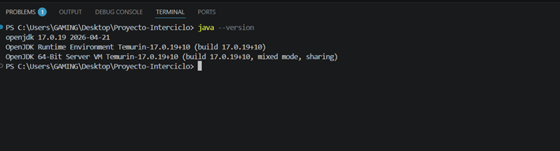

# Programación y Plataformas Web

## Práctica 1: Instalación, Configuración Inicial y Primer Endpoint

**Estudiante:** Sebastian Zurita  
**Carrera:** Ingeniería en Ciencias de la Computación  
**Institución:** Universidad Politécnica Salesiana  

---

## 1. Introducción al Framework
Spring Boot es un framework moderno diseñado bajo la filosofía *opinionated*, lo que significa que proporciona configuraciones por defecto para simplificar el inicio de proyectos Java orientados a la web. Su principal ventaja es la inclusión de servidores HTTP embebidos, permitiendo que las aplicaciones se ejecuten de forma autónoma (stand-alone) sin necesidad de despliegues externos complejos.

---

## 10. Resultados y Evidencias

### 1. Captura de verificación de Java
Verificación de la instalación del entorno de ejecución Java en su versión estable 17 (Eclipse Temurin LTS), asegurando la compatibilidad con el ecosistema del proyecto.

```bash
java -version

